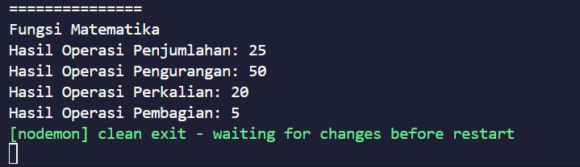
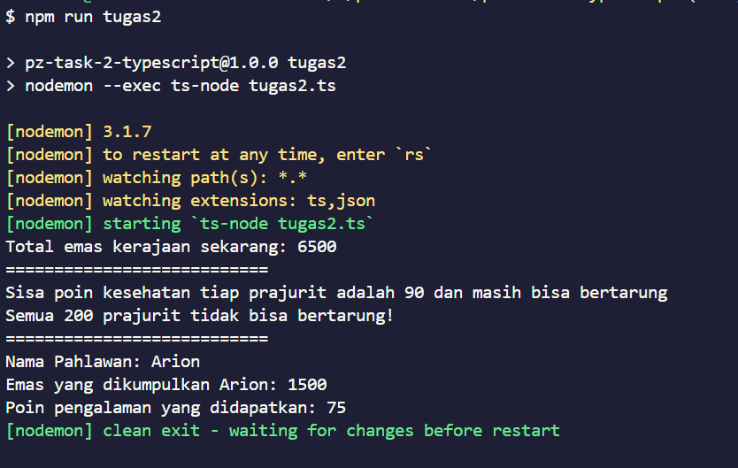

# Tugas Typescript

## Deskripsi
Pada repository ini terdapat 2 tugas typescript

## Cara Instalasi

1. Clone repository ini di terminal dengan cara:
    ```bash
    git clone https://github.com/danendradipa/pz-task2-typescript-danendra.git
    ```

## Cara Menjalankan Kode

1. Menjalankan Tugas 1 di terminal dengan perintah
    ```bash
    npm run tugas1
    ```

2. Menjalankan Tugas 2 di terminal dengan perintah
    ```bash
    npm run tugas2
    ```

## Hasil Screenshot

